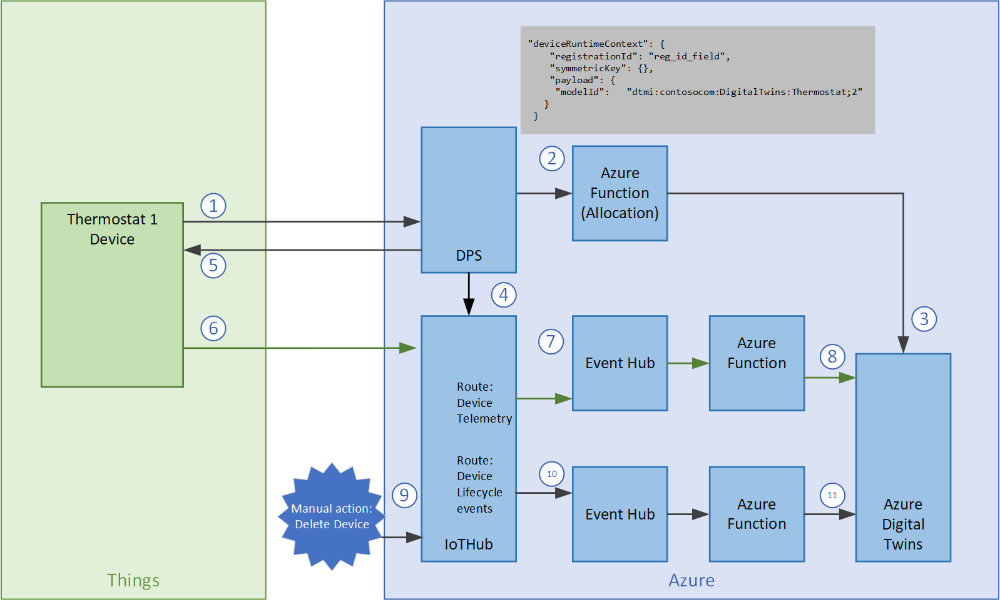

# Azure Digital Twin and IoT Hub Integration Sample

This is a sample project to show possible patterns for the automatic integration of the new Azure Digital Twins and IoT Hub. The following scenarios are implemented:

* An Azure Device Provisioning Service (DPS) custom allocation Azure Function to look up details for a device in Azure Digital Twins and inform the provisioning process.
* A simulated device device that sends the necessary information to DPS for the allocation decision.
* An Azure Function that maps device telemetry to the ADT twin instance and updates a property on the twin (a Temperature Property).
* An Azure Function that implements the automatic deletion of an Azure Digital Twin entity when the linked device is deleted in IoT Hub.
* Two Event Hubs for the telemetry messages and device lifecycle events to automatically interact with ADT.
* A Node.js application to simulate a device.

## How to use this sample

* Set up an Azure Digital Twin Service using the [documentation](https://docs.microsoft.com/en-us/azure/digital-twins/how-to-set-up-instance-scripted)
* Create an IoT Hub, Device Provisioning Service and an Azure Functions service.
* Create an Event Hubs namespace and two event hubs. 
  - `lifecycleevents`
  - `deviceevents`
* Create a consumer group in each event hub.
* Create two endpoints in Azure IoT Hub: pointing to each of the Event Hubs.
* Create a Route for device events deviceevents endpoint. 
* Create a Route for Device Lifecycle events to the lifecycleevents event hub endpoint.
* Download and install Visual Studio Code and the following extensions:
  * Azure IoT Tools
  * Azuer Functions
* Clone this repo
* `cd functions`
* `dotnet restore`
* Deploy the application to your Azure Functions. Set the following configuration app settings:
  - `AdtAppId`
  - `AdtInstanceUrl`
  - `EVENTHUB_CONNECTIONSTRING`
* Create a Group Enrollment in DPS and link to the `DpsAdtAllocationFunc` in your functions instance.
* Customise the device simulator code with the credentials for your DPS Scope and run the code.

# Key Concepts

The integration flow between IoT Hub, DPS and Azure Digital Twins is the following:



Let's go through each of the steps.

Note: we assume Azure Digital Twins has been setup with the models supplied in this repo (see folder /models).

1. Device is using Azure IoT SDK to connect to DPS for getting itself provisioned in IoT Hub. Within the DPS request, it sets a custom payload which includes the ADT Model ID. 
2. DPS enrollment group is setup with a custom allocation policy (Azure Function). 
```
{
    "enrollmentGroup": {
        "enrollmentGroupId": "test1",
        ...
    },
    "deviceRuntimeContext": {
        "registrationId": "deviceid_reg",
        "symmetricKey": {},
        "payload": {
            "modelId": "dtmi:contosocom:DigitalTwins:Thermostat;2"
        }
    },
    "linkedHubs": [
        "HUB_NAME.azure-devices.net"
    ]
}
```
3. The custom allocation policy uses the `modelId` from the custom payload, along with the `RegistrationId` to query ADT:
  - If a Twin instance with the supplied RegistrationId exists, then it simply returns its ID to the function.
  - If not, the function creates it and returns its ID to the function.
  The function returns custom Device Twin to DPS for initializing the device.
  ```
  "tags": {
    "dtId": "the_twin_instance_id",
    "dtmi": "dtmi:contosocom:DigitalTwins:Thermostat;2"
  },
  ```
4. DPS uses the information from the custom allocation function to provision the device in the right IoT Hub, along with custom Device Twin Tags.
5. Device gets the assigned hub and connects.
6. Device uses IoT Hub SDK to send telemetry to the assigned IoT Hub.
7. In IoT Hub, a Route is setup to send the Telemetry messages to an Event Hub, while adding Message Enrichments.
8. Azure Function `DeviceTelemetryToTwinFunc` consumes from the Event Hub, picks up each message and updates the Twin instance Id in ADT. For this example, we update the `Temperature' Property in the Twin.
9. A manual action can be taken to delete the Device from IoT Hub. 
10. In this case, we also want to delete the Twin instance for that device in ADT. To do this we create a Route in IoT Hub to send all 'Lifecycle events' to another Event Hub. Function `DeleteDeviceInTwinFunc` consumes the event hub.
11. If the operation is of type `deleteDeviceIdentity`, we use ADT API to find the Twin instance to be deleted.

