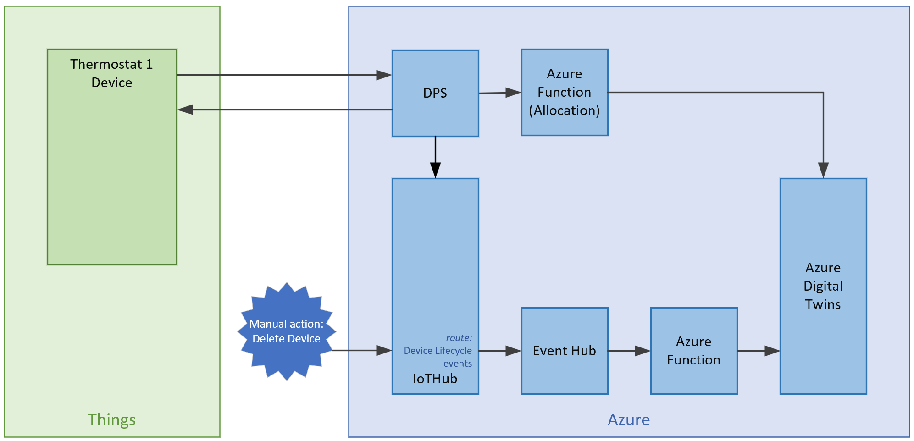
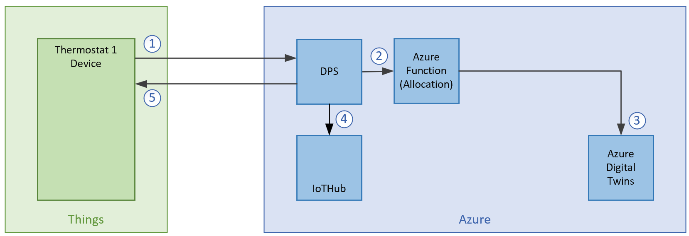
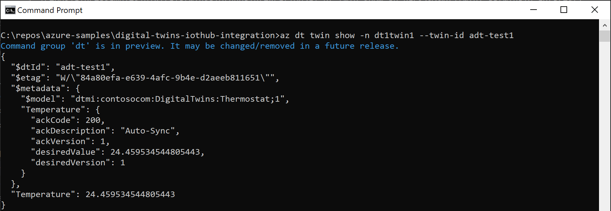
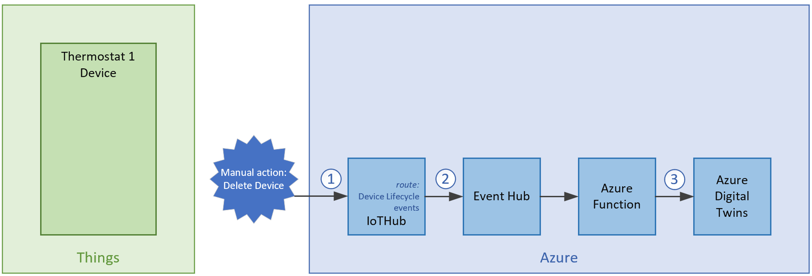
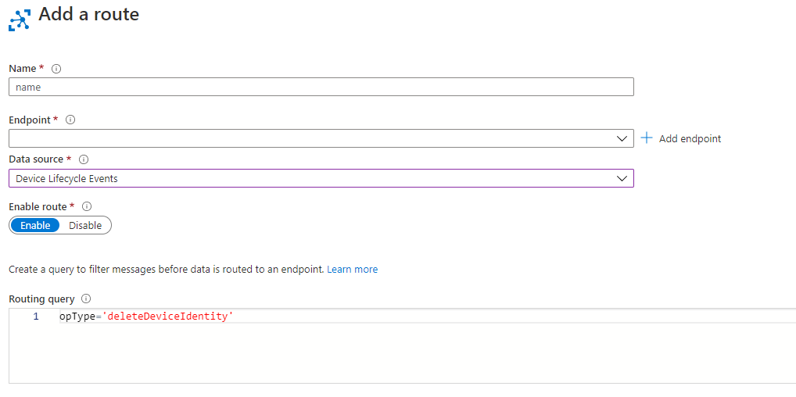

---
# Mandatory fields.
title: Azure Digital Twins auto-provisioning using Device Provisioning Service
titleSuffix: Azure Digital Twins
description: See how to set up automated process to provision and retire IoT devices in Azure Digital Twins using Device Provisioning Service.
author: michielvanschaik
ms.author: mivansch # Microsoft employees only
ms.date: 8/27/2020
ms.topic: how-to
ms.service: digital-twins

# Optional fields. Don't forget to remove # if you need a field.
# ms.custom: can-be-multiple-comma-separated
# ms.reviewer: MSFT-alias-of-reviewer
# manager: MSFT-alias-of-manager-or-PM-counterpart
---

# Azure Digital Twins auto-provisioning using Device Provisioning Service

In this article, you'll learn how to integrate Azure Digital Twins with [Device Provisioning Service (DPS)](https://docs.microsoft.com/en-us/azure/iot-dps/about-iot-dps).

The solution described in this article will allow you to automate the process to _provision_ and _retire_ IoT Hub devices in Azure Digital Twins, using Device Provisioning Service. 

For more information about the _provision_ and _retire_ stages, and to better understand the set of general device management stages that are common to all enterprise IoT projects, see the [*Device Lifecycle* section](https://docs.microsoft.com/en-us/azure/iot-hub/iot-hub-device-management-overview#device-lifecycle) of IoT Hub's device management documentation.

## Prerequisites

Before you can set up the provisioning, you need to have an **Azure Digital Twins instance**.

If you do not have this set up already, you can create it by following the Azure Digital Twins [*Tutorial: Connect an end-to-end solution*](./tutorial-end-to-end.md). The tutorial will walk you through setting up an Azure Digital Twins instance and a connected Azure IoT Hub.

You will need the following values in the rest of this article from the step you just completed. If you need to gather these values again, use the links below to the corresponding sections in the setup article for finding them in the [Azure portal](https://portal.azure.com).
* Azure Digital Twins instance **_host name_** ([find in portal](how-to-set-up-instance-portal.md#verify-success-and-collect-important-values))
* Azure Event Hubs connection string **_connection string_** ([find in portal](../event-hubs/event-hubs-get-connection-string#get-connection-string-from-the-portal))

This sample uses a device simulator that includes provisioning using the Device Provisioning Service. The device simulator is located here: [Azure Digital Twins and IoT Hub Integration Sample](https://docs.microsoft.com/samples/azure-samples/digital-twins-iothub-integration/adt-iothub-provision-sample/). Get the sample project on your machine by navigating to the sample link and selecting the *Download ZIP* button underneath the title. Unzip the downloaded folder.

The device simulator is based on Node.js, version 10.0.x or later. [*Prepare your development environment*](https://github.com/Azure/azure-iot-sdk-node/blob/master/doc/node-devbox-setup.md) describes how to install Node.js for this tutorial on either Windows or Linux.

## Solution architecture

The image below illustrates both the device provision and retire flow.



This article is divided into two sections:
* [*Auto-provision device using Device Provisioning Service*](#auto-provision-device-using-device-provisioning-service)
* [*Auto-retire device using IoT Hub Lifecycle events*](#auto-retire-device-using-iot-hub-lifecycle-events)

For deeper explanations of each step in the architecture, see their individual sections later in the article.

## Auto-provision device using Device Provisioning Service

You will be attaching Device Provisioning Service to Azure Digital Twins to auto-provision devices through the path below.



Here is a description of the process flow:
1. Device contacts the DPS endpoint, passing identifying information to prove its identity.
2. DPS validates device identity by validating the registration ID and key against the enrollment list, and calls an Azure function to do the allocation.
3. The Azure function creates a new twin in Azure Digital Twins for the device.
4. DPS registers the device with an IoT hub, and populates the device's desired twin state.
5. The IoT hub returns device ID information and the IoT hub connection information to the device. The device can now connect to the IoT hub.

The following sections describe the process steps to set up the auto-provision device flow.

### Create a Device Provisioning Service

When a new device is provisioned using Device Provisioning Service, a new twin for that device can be created in Azure Digital Twins.

Create a Device Provisioning Service instance, which will be used to provision IoT devices. You can either use the Azure CLI instructions below, or use the Azure portal: [*Quickstart: Set up the IoT Hub Device Provisioning Service with the Azure portal*](../iot-dps/quick-setup-auto-provision).

The following Azure CLI command will create a Device Provisioning Service. You will need to specify a name, resource group, and region.

```azurecli-interactive
az iot dps create --name <Device Provisioning Service name> --resource-group <resource group name> --location <region; for example, eastus>
```

### Create an Azure function

Next, you'll create an HTTP request-triggered function inside a function app. You can use the function app created in the end-to-end tutorial ([*Tutorial: Connect an end-to-end solution*](./tutorial-end-to-end.md)), or your own.

This function will be used by the Device Provisioning Service in a [Custom Allocation Policy](../iot-dps/how-to-use-custom-allocation-policies) provisioning a new device. For more information about using HTTP requests with Azure functions, see [*Azure Http request trigger for Azure Functions*](../azure-functions/functions-bindings-http-webhook-trigger.md).

Inside your function app project, add a new function. Also, add a new Nuget package to the project: `Microsoft.Azure.Devices.Provisioning.Service`.

In the newly created function code file, paste in the following code.

```C#
using System;
using System.IO;
using System.Threading.Tasks;
using Microsoft.AspNetCore.Mvc;
using Microsoft.Azure.WebJobs;
using Microsoft.Azure.WebJobs.Extensions.Http;
using Microsoft.AspNetCore.Http;
using Microsoft.Extensions.Logging;
using Microsoft.Azure.Devices.Shared;
using Microsoft.Azure.Devices.Provisioning.Service;
using System.Net.Http;
using Azure.Identity;
using Azure.DigitalTwins.Core;
using Azure.Core.Pipeline;
using Azure;
using System.Collections.Generic;
using Newtonsoft.Json;
using Newtonsoft.Json.Linq;

namespace Samples.AdtIothub
{
    public static class DpsAdtAllocationFunc
    {
        const string adtAppId = "https://digitaltwins.azure.net";
        private static string adtInstanceUrl = Environment.GetEnvironmentVariable("ADT_SERVICE_URL");
        private static readonly HttpClient httpClient = new HttpClient();

        [FunctionName("DpsAdtAllocationFunc")]
        public static async Task<IActionResult> Run(
            [HttpTrigger(AuthorizationLevel.Function, "get", "post", Route = null)] HttpRequest req, ILogger log)
        {
            // Get request body
            string requestBody = await new StreamReader(req.Body).ReadToEndAsync();
            log.LogDebug($"Request.Body: {requestBody}");
            dynamic data = JsonConvert.DeserializeObject(requestBody);

            // Get registration ID of the device
            string regId = data?.deviceRuntimeContext?.registrationId;

            bool fail = false;
            string message = "Uncaught error";
            ResponseObj obj = new ResponseObj();

            // Must have unique registration ID on DPS request 
            if (regId == null)
            {
                message = "Registration ID not provided for the device.";
                log.LogInformation("Registration ID: NULL");
                fail = true;
            }
            else
            {
                string[] hubs = data?.linkedHubs.ToObject<string[]>();

                // Must have hubs selected on the enrollment
                if (hubs == null)
                {
                    message = "No hub group defined for the enrollment.";
                    log.LogInformation("linkedHubs: NULL");
                    fail = true;
                }
                else
                {
                    // Find or create twin based on the provided registration ID and model ID
                    dynamic payloadContext = data?.deviceRuntimeContext?.payload;
                    string dtmi = payloadContext.modelId;
                    log.LogDebug($"payload.modelId: {dtmi}");
                    string dtId = await FindOrCreateTwin(dtmi, regId, log);

                    // Get first linked hub (TODO: select one of the linked hubs based on policy)
                    obj.iotHubHostName = hubs[0];

                    // Specify the initial tags for the device.
                    TwinCollection tags = new TwinCollection();
                    tags["dtmi"] = dtmi;
                    tags["dtId"] = dtId;

                    // Specify the initial desired properties for the device.
                    TwinCollection properties = new TwinCollection();

                    // Add the initial twin state to the response.
                    TwinState twinState = new TwinState(tags, properties);
                    obj.initialTwin = twinState;
                }
            }

            log.LogDebug("Response: " + ((obj.iotHubHostName != null) ? JsonConvert.SerializeObject(obj) : message));

            return (fail)
                ? new BadRequestObjectResult(message)
                : (ActionResult)new OkObjectResult(obj);
        }

        public static async Task<string> FindOrCreateTwin(string dtmi, string regId, ILogger log)
        {
            // Create Digital Twins client
            var cred = new ManagedIdentityCredential(adtAppId);
            var client = new DigitalTwinsClient(new Uri(adtInstanceUrl), cred, new DigitalTwinsClientOptions { Transport = new HttpClientTransport(httpClient) });

            // Find existing twin with registration ID
            string dtId;
            string query = $"SELECT * FROM DigitalTwins T WHERE $dtId = '{regId}' AND IS_OF_MODEL('{dtmi}')";
            AsyncPageable<string> twins = client.QueryAsync(query);
            
            await foreach (string twinJson in twins)
            {
                // Get DT ID from the Twin
                JObject twin = (JObject)JsonConvert.DeserializeObject(twinJson);
                dtId = (string)twin["$dtId"];
                log.LogInformation($"Twin '{dtId}' with Registration ID '{regId}' found in DT");
                return dtId;
            }

            // Not found, so create new twin
            log.LogInformation($"Twin ID not found, setting DT ID to regID");
            dtId = regId; // use the Registration ID as the DT ID

            // Define the model type for the twin to be created
            Dictionary<string, object> meta = new Dictionary<string, object>()
            {
                { "$model", dtmi }
            };
            // Initialize the twin properties
            Dictionary<string, object> twinProps = new Dictionary<string, object>()
            {
                { "$metadata", meta }
            };
            twinProps.Add("Temperature", 0.0);
            await client.CreateDigitalTwinAsync(dtId, System.Text.Json.JsonSerializer.Serialize<Dictionary<string, object>>(twinProps));
            log.LogInformation($"Twin '{dtId}' created in DT");

            return dtId;
        }
    }

    public class ResponseObj
    {
        public string iotHubHostName { get; set; }
        public TwinState initialTwin { get; set; }
    }
}
```

Save the file and then re-publish your function app. For instructions on publishing the function app, see the [*Publish the app*](tutorial-end-to-end.md#publish-the-app) section of the end-to-end tutorial.

### Configure your function

Next, you'll need to set environment variables in your function app from earlier, containing the reference to the Azure Digital Twins instance you've created. If you used the the end-to-end tutorial ([*Tutorial: Connect an end-to-end solution*](./tutorial-end-to-end.md)) the setting will already be configured.

Add the setting with this command:

```azurecli-interactive
az functionapp config appsettings set --settings "ADT_SERVICE_URL=https://<Azure Digital Twins instance _host name_>" -g <resource group> -n <your App Service (function app) name>
```

Ensure that the permissions and Managed Identity role assignment are configured correctly for the function app, as described in the section *Assign permissions to the function app* in the end-to-end tutorial ([*Tutorial: Connect an end-to-end solution*](./tutorial-end-to-end#assign-permissions-to-the-function-app)).

<!-- 
* Azure AD app registration **_Application (client) ID_** ([find in portal](../articles/digital-twins/how-to-set-up-instance-portal.md#collect-important-values))

```azurecli-interactive
az functionapp config appsettings set --settings "AdtAppId=<Application (client)" ID> -g <resource group> -n <your App Service (function app) name> 
``` -->

### Create Device Provisioning enrollment

Next, you'll need to create an enrollment in Device Provisioning Service using a custom allocation function. You can find the instructions to do this in [*Create the enrollment*](../iot-dps/how-to-use-custom-allocation-policies#create-the-enrollment.md).

Link the enrollment to the function you just created, by selecting the function in the 'Select how you want to assign devices to hubs' field. The enrollment name and primary or secondary SAS key will be used later to configure the device simulator.

### Setting up the device simulator

This sample uses a device simulator that includes provisioning using the Device Provisioning Service. The device simulator is located here: [Azure Digital Twins and IoT Hub Integration Sample](https://docs.microsoft.com/samples/azure-samples/digital-twins-iothub-integration/adt-iothub-provision-sample/). Get the sample project on your machine by navigating to the sample link and selecting the *Download ZIP* button underneath the title. Unzip the downloaded folder.

In the downloaded folder, navigate to the *device-simulator* directory in a command window. Install the dependencies for the project using the following command:

```cmd
npm install
```

Next, copy the *.env.template* file to a new file called *.env*, and fill in these settings:

```cmd
PROVISIONING_HOST = "global.azure-devices-provisioning.net"
PROVISIONING_IDSCOPE = "<Device Provisioning Service Scope ID>"
PROVISIONING_REGISTRATION_ID = "<Device Registration ID>"
ADT_MODEL_ID = "dtmi:contosocom:DigitalTwins:Thermostat;1"
PROVISIONING_SYMMETRIC_KEY = "<Device Provisioning Service enrollment primary or secondary SAS key>"
```

Save and close the file.

### Start running the device simulator

Still in the *device-simulator* directory in your command window, start the device simulator using the following command:

```cmd
node .\adt_custom_register.js
```

You should see the device being registered and connected to IoT Hub, and then starting to send messages.


### Validate

The device will be automatically registered in Azure Digital Twins. Using the following command to find the twin of the device in the Azure Digital Twins instance you created.

```azurecli-interactive
az dt twin show -n <Digital Twins instance name> --twin-id <Device Registration ID>"
```

You should see the twin of the device being found in the Azure Digital Twins instance.


## Auto-retire device using IoT Hub Lifecycle events

Next, you will be attaching IoT Hub Lifecycle events to Azure Digital Twins to auto-retire devices through the path below.



Here is a description of the process flow:
1. An external or manual process triggers the deletion of a device in IoT Hub.
2. IoT Hub deletes the device and generates a Device Lifecycle event that will be routed to an Event Hub.
3. An Azure Function deletes the twin of the device in Azure Digital Twins.

The following sections describe the process steps to set up the auto-retire device flow.

### Create an Event Hub

You now need to create an Azure [Event Hub](../event-hubs/event-hubs-about.md), which will be used to receive the IoT Hub lifecycle events. 

Go through the steps described in the [*Create an Event Hub*](https://docs.microsoft.com/en-us/azure/event-hubs/event-hubs-create) quickstart, using the following information:
* If you're using the end-to-end tutorial ([*Tutorial: Connect an end-to-end solution*](./tutorial-end-to-end.md)), you can reuse the resource group you created for the end-to-end tutorial.
* Name your event hub *lifecycleevents*, and remember the namespace you created. You will use this when you set up the lifecycle function and IoT Hub route in the next sections.

### Create an Azure Function

Next, you'll create an Event Hubs-triggered function inside a function app. You can use the function app created in the end-to-end tutorial ([*Tutorial: Connect an end-to-end solution*](./tutorial-end-to-end.md)), or your own. 

Name your event hub trigger *lifecycleevents*, and connect the event hub trigger to the Event Hub you created in the previous step. If you used another Event Hub name, change it to match in the trigger name below.

This function will use the IoT Hub Device Lifecycle Events to retire an existing device. For more about livecycle events, see [*IoT Hub Non-telemetry events*](https://docs.microsoft.com/en-us/azure/iot-hub/iot-hub-devguide-messages-d2c#non-telemetry-events). For more information about using Event Hubs with Azure functions, see [*Azure Event Hubs trigger for Azure Functions*](../azure-functions/functions-bindings-event-hubs-trigger.md).

Inside your published function app, add a new function class of type 'Event Hub Trigger', and paste in the code below.

```C#
using System;
using System.Collections.Generic;
using System.Linq;
using System.Net.Http;
using System.Threading.Tasks;
using Azure;
using Azure.Core.Pipeline;
using Azure.DigitalTwins.Core;
using Azure.DigitalTwins.Core.Serialization;
using Azure.Identity;
using Microsoft.Azure.EventHubs;
using Microsoft.Azure.WebJobs;
using Microsoft.Extensions.Logging;
using Newtonsoft.Json;
using Newtonsoft.Json.Linq;

namespace Samples.AdtIothub
{
    public static class DeleteDeviceInTwinFunc
    {
        private static string adtAppId = "https://digitaltwins.azure.net";
        private static readonly string adtInstanceUrl = System.Environment.GetEnvironmentVariable("ADT_SERVICE_URL", EnvironmentVariableTarget.Process);
        private static readonly HttpClient httpClient = new HttpClient();

        [FunctionName("DeleteDeviceInTwinFunc")]
        public static async Task Run(
            [EventHubTrigger("lifecycleevents", Connection = "EVENTHUB_CONNECTIONSTRING")] EventData[] events, ILogger log)
        {
            var exceptions = new List<Exception>();

            foreach (EventData eventData in events)
            {
                try
                {
                    //log.LogDebug($"EventData: {System.Text.Json.JsonSerializer.Serialize(eventData)}");

                    string opType = eventData.Properties["opType"] as string;
                    if (opType == "deleteDeviceIdentity")
                    {
                        string deviceId = eventData.Properties["deviceId"] as string;
                        
                        // Create Digital Twin client
                        var cred = new ManagedIdentityCredential(adtAppId);
                        var client = new DigitalTwinsClient(new Uri(adtInstanceUrl), cred, new DigitalTwinsClientOptions { Transport = new HttpClientTransport(httpClient) });

                        // Find twin based on the original Registration ID
                        string regID = deviceId; // simple mapping
                        string dtId = await GetTwinId(client, regID, log);
                        if (dtId != null)
                        {
                            await DeleteRelationships(client, dtId, log);

                            // Delete twin
                            await client.DeleteDigitalTwinAsync(dtId);
                            log.LogInformation($"Twin '{dtId}' deleted in DT");
                        }
                    }
                }
                catch (Exception e)
                {
                    // We need to keep processing the rest of the batch - capture this exception and continue.
                    exceptions.Add(e);
                }
            }

            if (exceptions.Count > 1)
                throw new AggregateException(exceptions);

            if (exceptions.Count == 1)
                throw exceptions.Single();
        }


        public static async Task<string> GetTwinId(DigitalTwinsClient client, string regId, ILogger log)
        {
            string query = $"SELECT * FROM DigitalTwins T WHERE T.$dtId = '{regId}'";
            AsyncPageable<string> twins = client.QueryAsync(query);
            await foreach (string twinJson in twins)
            {
                JObject twin = (JObject)JsonConvert.DeserializeObject(twinJson);
                string dtId = (string)twin["$dtId"];
                log.LogInformation($"Twin '{dtId}' found in DT");
                return dtId;
            }

            return null;
        }

        public static async Task DeleteRelationships(DigitalTwinsClient client, string dtId, ILogger log)
        {
            var relationshipIds = new List<string>();

            AsyncPageable<string> relationships = client.GetRelationshipsAsync(dtId);
            await foreach (var relationshipJson in relationships)
            {
                BasicRelationship relationship = System.Text.Json.JsonSerializer.Deserialize<BasicRelationship>(relationshipJson);
                relationshipIds.Add(relationship.Id);
            }

            foreach (var relationshipId in relationshipIds)
            {
                client.DeleteRelationship(dtId, relationshipId);
                log.LogInformation($"Twin '{dtId}' relationship '{relationshipId}' deleted in DT");
            }
        }
    }
}
```

Save the project, then publish the function app again. For instructions on publishing the function app, see the [*Publish the app*](tutorial-end-to-end.md#publish-the-app) section of the end-to-end tutorial.

### Configure your function

Next, you'll need to set environment variables in your function app from earlier, containing the reference to the Azure Digital Twins instance you've created and the event hub. If you used the the end-to-end tutorial ([*Tutorial: Connect an end-to-end solution*](./tutorial-end-to-end.md)) the first setting will already be configured.

Add the setting with this command:

```azurecli-interactive
az functionapp config appsettings set --settings "ADT_SERVICE_URL=https://<Azure Digital Twins instance _host name_>" -g <resource group> -n <your App Service (function app) name>
```

Next, you will need to configure the function environment variable for connecting to the newly created event hub.

```azurecli-interactive
az functionapp config appsettings set --settings "EVENTHUB_CONNECTIONSTRING=<Event Hubs SAS connection string Listen>" -g <resource group> -n <your App Service (function app) name>
```

Ensure that the permissions and Managed Identity role assignment are configured correctly for the function app, as described in the section *Assign permissions to the function app* in the end-to-end tutorial ([*Tutorial: Connect an end-to-end solution*](./tutorial-end-to-end#assign-permissions-to-the-function-app)).

### Create an IoT Hub route for Lifecycle events

Now you need to set up an IoT Hub route, to route device lifecycle events. In this case, you will specifically listen to device delete events, identified by `if (opType == "deleteDeviceIdentity")`. This will trigger the delete of the digital twin item, finalizing the retirement of a device and its digital twin.

Instructions for creating an IoT Hub route are described in this article: [*Use IoT Hub message routing to send device-to-cloud messages to different endpoints*](../iot-hub/iot-hub-devguide-messages-d2c). The section *Non-telemetry events* explains that you can use **device lifecycle events** as the data source for the route.

The steps you need to go through for this setup are:
* Create a custom IoT Hub event hub endpoint. This endpoint should target the event hub you create in the 'Create an Event Hub' section.
* Add a Device Lifecycle Events route. Use the endpoint created in the previous step. You can limit the device lifecycle events to only send the delete events by adding the routing query `opType='deleteDeviceIdentity'`.
    

Once you have gone through these steps, everything is set to retire devices end-to-end.

### Validate

To trigger the process of retirement, you need to manually delete the device from IoT Hub.

Use the process described in [part one](#auto-provision-device-using-device-provisioning-service) of this article to create a device and corresponding digital twin. 

Then, go to the IoT Hub and delete the device. The device will be automatically removed from Azure Digital Twins. 

Use the following command to verify the Twin of the device in the Azure Digital Twins instance was deleted.

```azurecli-interactive
az dt twin show -n <Digital Twins instance name> --twin-id <Device Registration ID>"
```

You should see that the twin of the device cannot be found in the Azure Digital Twins instance anymore.


## Clean up resources

If you no longer need the resources created in this article, follow these steps to delete them.

Using the Azure Cloud Shell, you can delete all Azure resources in a resource group with the [az group delete](https://docs.microsoft.com/cli/azure/group?view=azure-cli-latest#az-group-delete) command. This removes the resource group; the Azure Digital Twins instance; the IoT hub and the hub device registration; the event grid topic and associated subscriptions; the event hubs namespace and both Azure Functions apps, including associated resources like storage.

> [!IMPORTANT]
> Deleting a resource group is irreversible. The resource group and all the resources contained in it are permanently deleted. Make sure that you do not accidentally delete the wrong resource group or resources. 

```azurecli-interactive
az group delete --name <your-resource-group>
```
<!-- 
Next, delete the Azure AD app registration you created for your client app with this command:

```azurecli
az ad app delete --id <your-application-ID>
``` -->

Finally, delete the project sample folder you downloaded from your local machine.

## Next steps

The digital twins created for the devices are stored as a flat hierarchy in Azure Digital Twins, but they can be enriched with model information and a multi-level hierarchy for organization. To learn more about this concept, read:

* [*Concept: Understand digital twins and their twin graph*](concepts-twins-graph)

You can write custom logic to automatically provide this information using the model and graph data already stored in Azure Digital Twins. To read more about managing, upgrading, and retrieving information from the twins graph, see the following references:

* [*How-to: Manage a digital twin*](how-to-manage-twin.md)
* [*How-to: Query the twin graph*](how-to-query-graph.md)